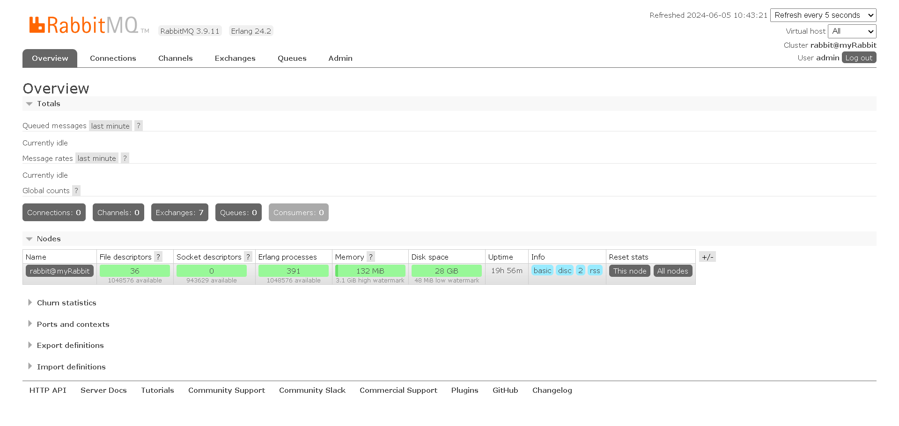

## 前置条件

版本：RabbitMQ 3.9.11 Erlang 24.2

地址：http://Your_Server_IP:15672/（这是默认的，可以更改）

第一次访问需要登录，默认的账号密码为：`guest/guest`（最好不要默认密码）

## 主要功能模块介绍

### 1、Overview**概览**

该栏目主要展示的是`MQ`的概要信息 , 如消息的数量，`Connection`，`Channel`，`Exchange`，`Queue`，`Consumer`的数量

- 显示RabbitMQ服务器的一般信息，如节点的名字、状态、运行时间等。
- 如果是集群，也可以查看集群中各个节点的情况，包括RabbitMQ的端口映射信息等。

### 2、Connections**连接**

### 3、channels**通道**

### 4、Exchanges交换器

该栏目主要展示的是当前虚拟主机下的交换器，也可以在此添加一个新的交换器， 并且配 置对应的交换器的规则属性 。

### 5、Queues**队列**

### 6、Admin**管理**

