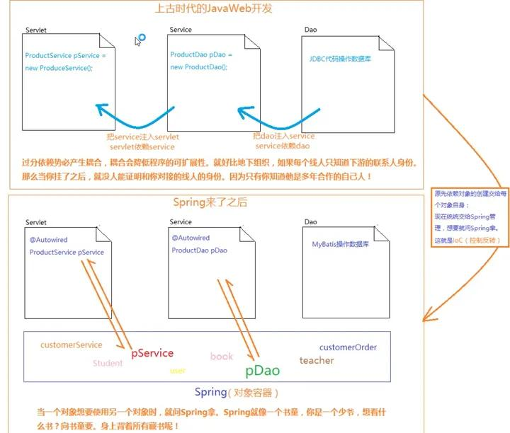
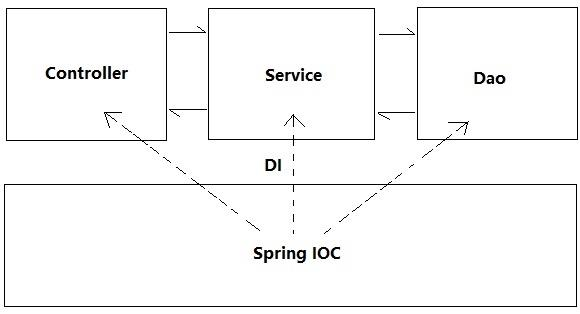

# spring是什么？

Spring用一句话概述就是：一个精巧的Bean容器。它拥有两个非常重要的概念：IoC和AOP。

### **IoC**

所谓的[控制反转](https://www.zhihu.com/search?q=控制反转&search_source=Entity&hybrid_search_source=Entity&hybrid_search_extra={"sourceType"%3A"answer"%2C"sourceId"%3A"1818980551"})。通俗地讲，就是把原本需要程序员自己创建和维护的一大堆bean统统交由Spring管理。 

也就是说，Spring将我们从盘根错节的依赖关系中解放了。当前对象如果需要依赖另一个对象，只要打一个@Autowired注解，Spring就会自动帮你安装上。

### **AOP**

所谓的[面向切面编程](https://www.zhihu.com/search?q=面向切面编程&search_source=Entity&hybrid_search_source=Entity&hybrid_search_extra={"sourceType"%3A"answer"%2C"sourceId"%3A"1818980551"})。通俗地讲，它一般被用来解决一些系统交叉业务的织入，比如日志啦、事务啥的。

## 参考资料

[如何学习 Spring ？学习 Spring 前要学习什么？ ](https://www.zhihu.com/question/321913492/answer/1818980551)

