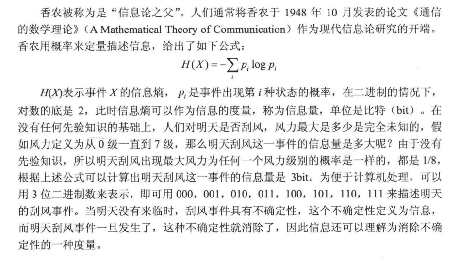

本章主要介绍信息系统综合知识,介绍信息、信息系统的基本概念,概述两化融合和国家信息化战略,讲解电子政务、电子商务的典型应用,描述信息化整体总体规划以及IT战略的主要内容。

## 1.1 信息的定义和属性

### 1.1.1 信息的基本概念

信息(information)是客观事物状态和运动特征的一种普遍形式,客观世界中大量地存在、产生和传递着以这些方式表示出来的各种各样的信息。

本体论信息概念（客观）：事物的运动状态和状态变化的自我表述。

- 事物：外部世界的物质客体或者主观领域的精神现象
- 运动：泛指一切意义上的变化或过程
- 状态：事物运动过程中呈现的相对稳定的形态
- 状态变化方式：事物运行的动态变化情形

哪里有事物和事物的运动，哪里就有本体论信息的存在

认识论信息概念（主体）：主体对于该事物的运行状态以及状态变化的方式的具体描述，包括它的“状态和方式”的形式、含义和价值的描述。

 所谓得到了某个事物的认识论信息,就是不仅知道了这个事物的运动状态和状态变化方式的表现形式,而且知道了这种"状态和方式"的含义以及它们对主体的价值。

因此,如果获得了足够的认识论信息,就可以根据它的形式、含义和价值做出恰当的判断和决策。反之,没有充分的认识论信息,人们的决策就可能带上盲目性。这就是认识论信息在认识论意义上的巨大作用。

认识论和奔腾论信息是想通的，他们核心都是“事物运动的状态和状态变化的方式”。引入主体因素,本体论信息就转化为认识论信息;去除主体因素,认识论信息就转化为本体论信息。

### 1.1.2 信息的变量描述

香农被称为是“信息论之父”

### 1.1.3 信息的传输模型

